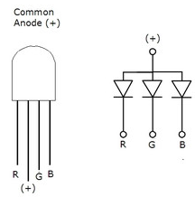
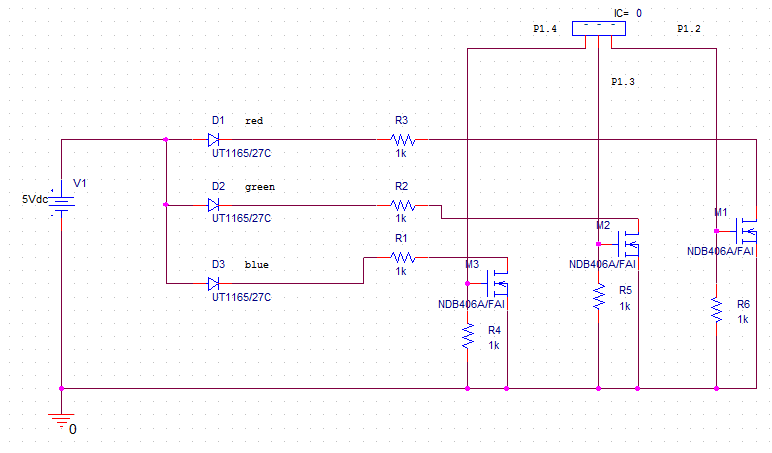
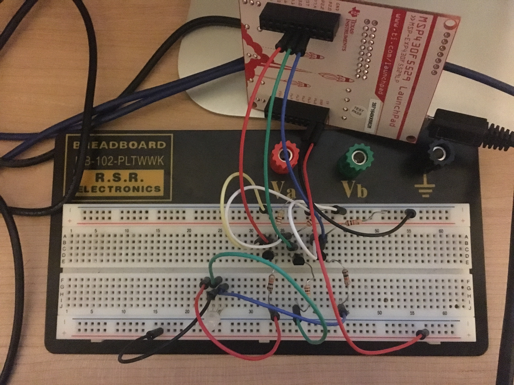
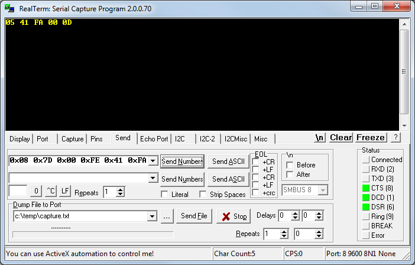
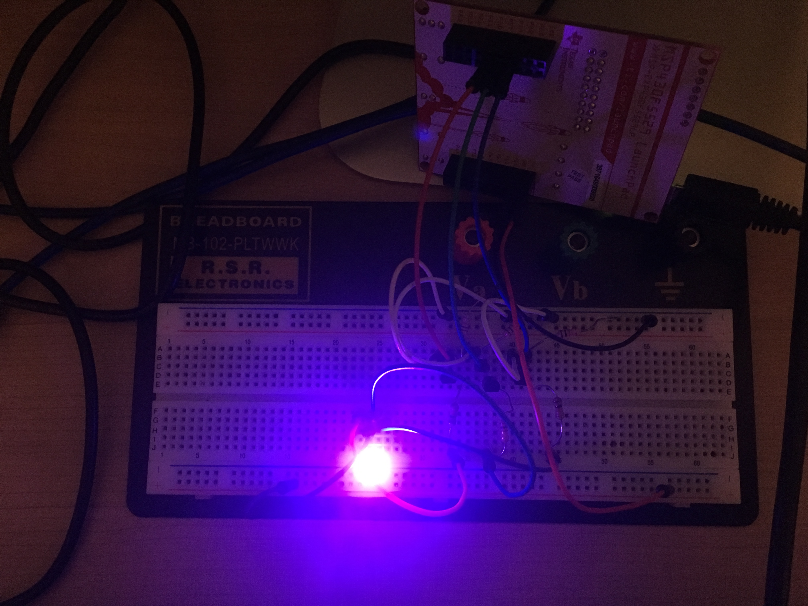

# Milestone 1: Communicating with Will Byers MSP430F5529
Thie objective is to control the color of an RGB LED through the use of UART and three individual PWM signals.
Multiple MSP430 boards can be connected together in any order using UART and the code should still work.

## Why MSP430F5529?
All of the board were considered but this one came out on top because of the easy and reliable implementation for hardware PWM along with reliable UART communication using the usb serial cable.

## Problems with other boards
### MSP430FR2311 
Only has Timer B, does not have reliable PWM, only works with UART USB backchannel
### MSP430FR5994
Doesn't reliably work with hardware PWM. Doesn't reliably work with UART serial cable
### MSP430FR6989 
Doesn't work at all with either UART USB backchannel or serial cable
### MSP430G2553 
Doesn't have enough CCR registers for 3 PWM

## Circuit
The RGB LED was common anode so a circuit needed to be created to support this. 




## PWM 
Hardware PWM was utilized for the MSP430F5529 for simplicity since this board supports up to seven PWM outputs. 
We need three PWM signals, one for each color of the led. The common anode means that the longest leg of the led
must be hooked up to VCC which I chose to be 5V. Each leg then is connected to a 1K resistor to limit the current running through the nMOS transistors.
The nMOS transistors are used as low side switches. This means that the gate is connected to a GPIO pin on the microcontroller which controls whether the led is on or not.
1K pulldown resistors are needed between the gate and ground for each of these transistors so that they aren't floating.
The headers on the bottom of the board were used to breakout the pins and power to a breadboard. 

### Red control: P1.2
### Green control: P1.3
### Blue control: P1.4





## UART
The UART structure was standardized so that each node in the chain will parse through 8 bytes worth of data to control the PWM on that board as well as what data to send to the next.
Using a serial to usb cable, the green was connected to P3.4 and white connected to P3.3. A packet with RGB values will be sent to the next board in the chain while the values that were used for the current board were removed.

### Byte 0: 
Total bytes in package 0x08
### Byte 1: 
Red duty cycle current board
### Byte 2:	
Green duty cycle current board
### Byte 3: 
Blue duty cycle current board
### Byte 4: 
Red duty cycle next board
### Byte 5: 
Green duty cycle next board
### Byte 6: 
Blue duty cycle next board
### Byte 7: 
End of message 0X0D


## UART Testing
The UART was tested using Realterm where an 8 byte string was sent to the board to turn the led a purple color. 
The Realterm displayed the data that will be transmitted to the next board which are rgb values encapsulated in a new 5 byte package. 

### Sent: 0x08 0x7D 0x00 0xFE 0x41 0xFA 0x00 0x0D






## Code
The code was broken up into a UART block and a PWM block. The UART is received, is iterated through byte by byte and the data is either received or transmitted based on the protocol defined above.

```c
/*
Matt Mammarelli
9/18/17
ECE 09342-2
*/

//MSP430F5529 Milestone
//Takes a string of bits over UART, parses it for the current and next rgb values, then transmits the next board rgb
//When incoming is 56 or greater bytes the txd will only output 48 bytes, need to reset after first transmit


#include <msp430f5529.h>

int byteCount=0; //the current byte that is iterating through the packet
int numBytes=0; //number of bytes in packet
int red,green,blue=0; //holds UART values for current rgb


void main(void)
{

  //stop watchdog timer
  WDTCTL = WDTPW + WDTHOLD;

  //uart **************************************************************************************************
  // P3.3, P3.4 transmit/receive
  P3SEL = BIT3+BIT4;
  // Put state machine in reset
  UCA0CTL1 |= UCSWRST;
  // SMCLK
  UCA0CTL1 |= UCSSEL_2;
  // 1MHz 9600 baud
  UCA0BR0 = 6;
  // 1MHz 9600
  UCA0BR1 = 0;
  //sets m control register
  UCA0MCTL = UCBRS_0 + UCBRF_13 + UCOS16;
  //sets control register
  UCA0CTL1 &= ~UCSWRST;
  //enable interrupt
  UCA0IE |= UCRXIE;
  //*******************************************************************************************************


  //rgb pwm *****************************************************************************************

  // P1.2 , P1.3, P1.4 output
  P1DIR |= BIT2+BIT3+BIT4;

  // P1.2 and P1.3, P1.4 options select GPIO
  P1SEL |= BIT2+BIT3+BIT4;

  // PWM Period about 1khz
  TA0CCR0 = 1024;

  // CCR1 reset/set
  TA0CCTL1 = OUTMOD_7;

  // CCR2 reset/set
  TA0CCTL2 = OUTMOD_7;

  // CCR3 reset/set
  TA0CCTL3 = OUTMOD_7;

  // SMCLK, up mode, clear TAR
  TA0CTL = TASSEL_2 + MC_1 + TACLR;

  //***************************************************************************************************

  // Low power mode
  __bis_SR_register(LPM0_bits + GIE);

  // For debugger
  __no_operation();
}


//uart interrupt vector
#pragma vector=USCI_A0_VECTOR
__interrupt void USCI_A0_ISR(void)
{
  switch(__even_in_range(UCA0IV,4))
  {
  case 0:break;   // Vector 0 - no interrupt
  case 2:{
      while (!(UCA0IFG&UCTXIFG));  // USCI_A0 TX buffer check
          if(byteCount==0){
                          numBytes = UCA0RXBUF;
                          byteCount++;


                      }
                      //current rgb
                      else if ((byteCount>0 & byteCount <4)){
                          switch(byteCount){
                          case 1:{
                              red = UCA0RXBUF;
                              // CCR1 PWM duty cycle red
                              TA0CCR1 = red * 4;
                              break;
                          }
                          case 2:{
                              green = UCA0RXBUF;
                              // CCR2 PWM duty cycle green
                              TA0CCR2 = green * 4;
                              break;
                          }
                          case 3:{
                              blue = UCA0RXBUF;
                              // CCR3 PWM duty cycle blue
                              TA0CCR3 = blue * 4;
                              //beginning of new transmit message
                              UCA0TXBUF = numBytes-3;
                              break;
                          }
                          default:break;


                          }

                          byteCount++;

                      }
                      //sending rgb and rest of message
                      else if (byteCount>3 & byteCount <= numBytes-1){
                          if (byteCount!=numBytes-1){
                              UCA0TXBUF = UCA0RXBUF;
                              byteCount++;
                          }
                          else{
                              UCA0TXBUF = 0x0D; //end of new message
                              byteCount=0;
                          }

                      }

          break;

  }

  case 4:break;    // Vector 4 - TXIFG
  default: break;
  }
}


```


  


